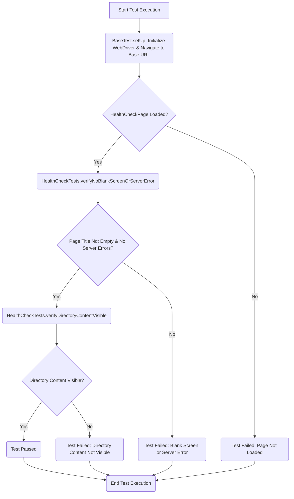

# sdd_selenium
GitHub Spec Kit and Selenium

## sdd-selenium-framework (Generated Structure)

Example structure of a Selenium framework (Java + Maven + TestNG).

### Created Structure:

```
sdd-selenium-framework/
├── .github/workflows/         # CI/CD Pipelines (GitHub Actions)
├── config/                    # Configuration files
├── src/
│   ├── main/                  # Support: drivers, pages, utils
│   └── test/                  # Tests: tests, data, listeners
├── pom.xml                    # Dependency Manager (Maven)
├── testng.xml                 # TestNG Configuration
└── README.md                  # Instructions
```

### How to Tag Tests:

```java
@Test(groups = {"smoke"})
public void smokeTest() {
    // Test implementation
}

@Test(groups = {"regression"})
public void regressionTest() {
    // Test implementation
}
```

```java
import com.project.annotations.TestCategory;

@TestCategory({"smoke", "critical"})
@Test
public void miTest() {
    // tu código
}
```

### How to Run (Local):

1) Ensure you have Java 17 and Maven installed.
2) From the project root, run:

```bash
mvn test
```
```bash
mvn test -DtestCategory=smoke
```
```bash
mvn test -DtestCategory=regression
```

### Notes:

- The project uses WebDriverManager to automatically download drivers.
- Update `config/env.qa.properties` or `config/env.staging.properties` according to your environment.
- `testng.xml` is configured for test suite execution with parameters (`baseUrl`, `browser`).
- For detailed AI agent guidance, see `AGENTS.md` (English version).
- Current test base URL: `https://www.uci.cu/index.php/directorio/personas`

---

## Framework Component Overview

This diagram illustrates the general relationship between feature specifications, test classes, and page objects within the framework.

```mermaid
graph TD
    subgraph Specifications
        A[TC-001: Initial Page Load]
        B[TC-002: Web Availability Check]
        C[TC-003: People Navigation]
        D[TC-006: "Any" Filter]
    end

    subgraph Test Classes
        E[PeopleDirectoryLoadTest.java]
        F[HealthCheckTests.java]
        G[PeopleSectionStaffListTest.java]
        H[AnyFilterAndPaginationTest.java]
    end

    subgraph Page Objects
        I[DirectoryPage.java]
        J[HealthCheckPage.java]
        K[PersonList.java]
        L[BasePage.java]
    end

    A --> E
    B --> F
    C --> G
    D --> H

    E --> I
    F --> J
    G --> I
    H --> I

    I --> K
    I --> L
    J --> L
    K --> L
```

---

## TC-002: Validate Application Responsiveness and Content Rendering Flow

This flowchart details the execution flow for the web availability health check test, demonstrating initialization, page loading, and content verification steps.



---

## TC-001: Initial Page Load and Directory Display Flow

This flowchart details the execution flow for the people directory initial load verification, demonstrating navigation, title/header verification, and initial list population.

```mermaid
graph TD
    A[Start Test: Initial Page Load] --> B(Navigate to Directory URL);
    B --> C{Page Loaded Successfully?};
    C -- Yes --> D(Verify Main Title and "Personas" Header);
    D --> E{Title and Header Visible?};
    E -- Yes --> F(Verify Default List of People is Visible);
    F --> G{People List Displayed?};
    G -- Yes --> H(Test Passed);
    C -- No --> I(Test Failed: Page Load Error);
    E -- No --> J(Test Failed: Title/Header Missing);
    G -- No --> K(Test Failed: People List Not Visible);
    H --> L(End Test);
    I --> L;
    J --> L;
    K --> L;
```

---

## TC-003: Validate Directory "People" Navigation and Data Rendering Flow

This flowchart details the execution flow for validating the "People" section navigation, demonstrating visibility, clicking, and content display.

```mermaid
graph TD
    A[Start Test: People Navigation] --> B(Navigate to Directory Page);
    B --> C(Verify "People" Option is Visible and Accessible);
    C --> D{Is "People" Option Visible?};
    D -- Yes --> E(Click "People" Option);
    E --> F{People Section Loads?};
    F -- Yes --> G(Verify List of Personnel Records is Displayed);
    G --> H{Personnel List Visible?};
    H -- Yes --> I(Verify Each Record Displays Full Name);
    I --> J(Verify Role/Title Displayed for Individuals);
    J --> K(Test Passed);
    D -- No --> L(Test Failed: "People" Option Missing);
    F -- No --> M(Test Failed: Section Not Loaded);
    H -- No --> N(Test Failed: Personnel List Not Visible);
    K --> O(End Test);
    L --> O;
    M --> O;
    N --> O;
```

---

## TC-006: View General Directory Listing Flow

This flowchart details the execution flow for validating the "Any" alphabetical filter with pagination, demonstrating filter selection, result display, and pagination functionality.

```mermaid
graph TD
    A[Start Test: "Any" Filter] --> B(Navigate to Directory Page);
    B --> C(Select "Any" Filter Option);
    C --> D{General List Displayed?};
    D -- Yes --> E(Verify Results Are Not Blank/Empty);
    E --> F{Results Not Empty?};
    F -- Yes --> G(Verify Pagination Controls are Functional);
    G --> H{Pagination Works?};
    H -- Yes --> I(Test Passed);
    D -- No --> J(Test Failed: List Not Displayed);
    F -- No --> K(Test Failed: Results Empty);
    H -- No --> L(Test Failed: Pagination Broken);
    I --> M(End Test);
    J --> M;
    K --> M;
    L --> M;
```