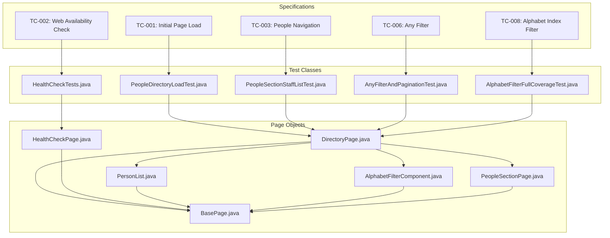
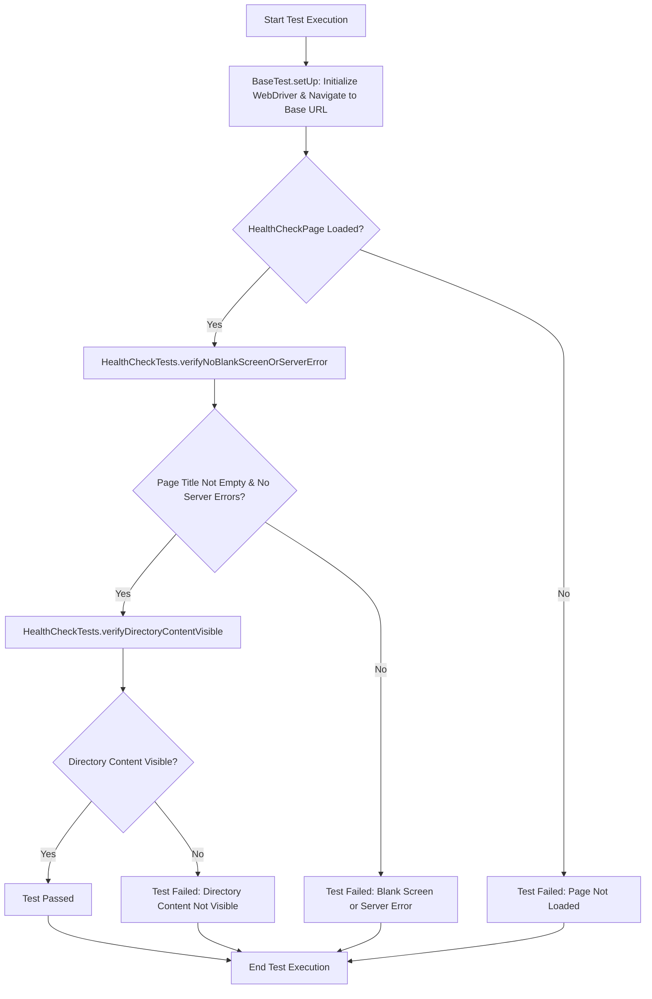
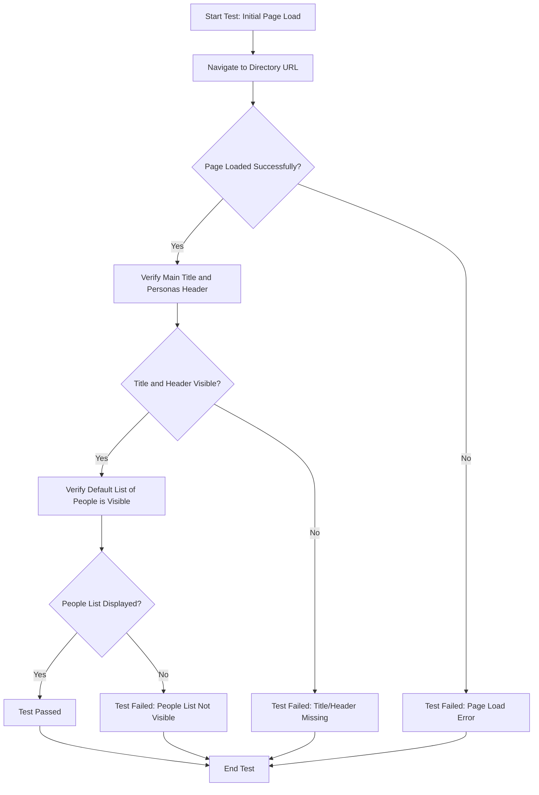
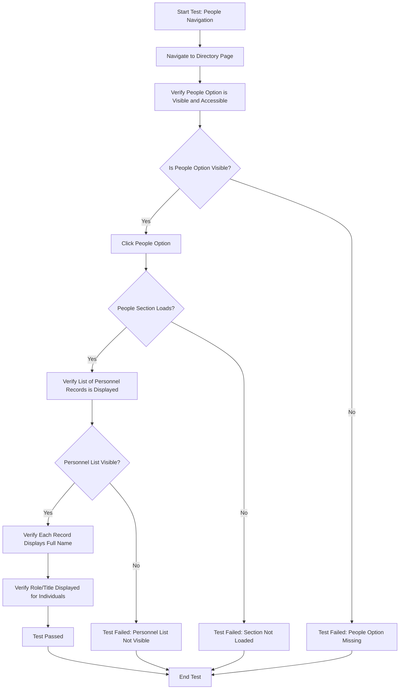
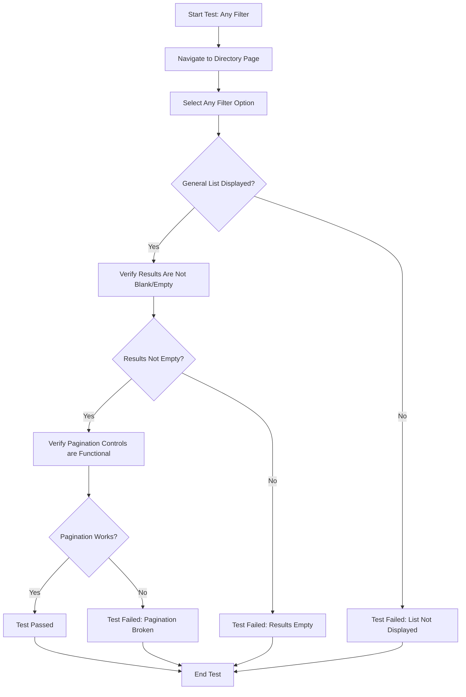
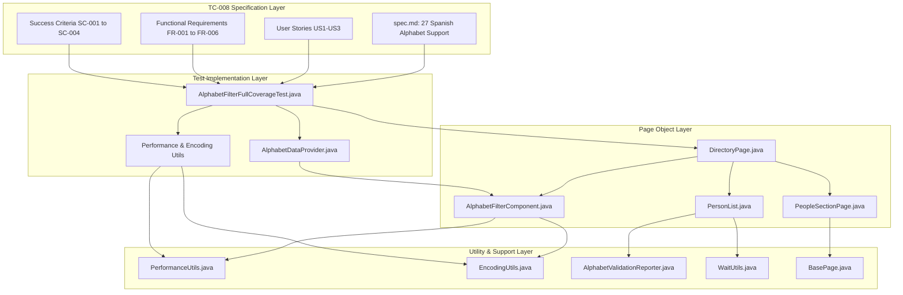
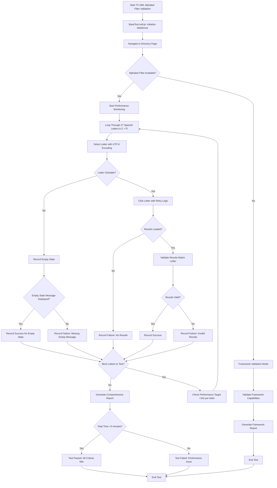

# sdd_selenium
GitHub Spec Kit and Selenium

## sdd-selenium-framework (Generated Structure)

Example structure of a Selenium framework (Java + Maven + TestNG).

### Created Structure:

```
sdd-selenium-framework/
├── .github/workflows/         # CI/CD Pipelines (GitHub Actions)
├── config/                    # Configuration files
├── src/
│   ├── main/                  # Support: drivers, pages, utils
│   └── test/                  # Tests: tests, data, listeners
├── pom.xml                    # Dependency Manager (Maven)
├── testng.xml                 # TestNG Configuration
└── README.md                  # Instructions
```

### How to Tag Tests:

```java
@Test(groups = {"smoke"})
public void smokeTest() {
    // Test implementation
}

@Test(groups = {"regression"})
public void regressionTest() {
    // Test implementation
}
```

```java
import com.project.annotations.TestCategory;

@TestCategory({"smoke", "critical"})
@Test
public void miTest() {
    // tu código
}
```

### How to Run (Local):

1) Ensure you have Java 17 and Maven installed.
2) From the project root, run:

```bash
mvn test
```
```bash
mvn test -DtestCategory=smoke -Dheadless=true
```
```bash
mvn test -DtestCategory=regression -Dheadless=true
```
```bash
mvn test -Dheadless=true
```
```bash
mvn test -DtestCategory=critical -Dheadless=true
```

### Notes:

- The project uses WebDriverManager to automatically download drivers.
- Update `config/env.qa.properties` or `config/env.staging.properties` according to your environment.
- `testng.xml` is configured for test suite execution with parameters (`baseUrl`, `browser`).
- For detailed AI agent guidance, see `AGENTS.md` (English version).
- Current test base URL: `https://www.uci.cu/index.php/directorio/personas`

---

## Framework Component Overview

This diagram illustrates the general relationship between feature specifications, test classes, and page objects within the framework.



---

## TC-002: Validate Application Responsiveness and Content Rendering Flow

This flowchart details the execution flow for the web availability health check test, demonstrating initialization, page loading, and content verification steps.



---

## TC-001: Initial Page Load and Directory Display Flow

This flowchart details the execution flow for the people directory initial load verification, demonstrating navigation, title/header verification, and initial list population.



---

## TC-003: Validate Directory People Navigation and Data Rendering Flow

This flowchart details the execution flow for validating the "People" section navigation, demonstrating visibility, clicking, and content display.



---

## TC-006: View General Directory Listing Flow

This flowchart details the execution flow for validating the "Any" alphabetical filter with pagination, demonstrating filter selection, result display, and pagination functionality.



---

## TC-008: Directory Alphabetical Index Filter Validation

This diagram illustrates the comprehensive architecture and relationships for the Spanish alphabet filter validation feature, supporting all 27 characters (A-Z + Ñ) with performance monitoring and UTF-8 encoding support.



---

## TC-008: Complete Alphabet Validation Flow

This flowchart details the execution flow for validating all 27 Spanish alphabet characters with performance monitoring, empty state handling, and UTF-8 encoding support.

